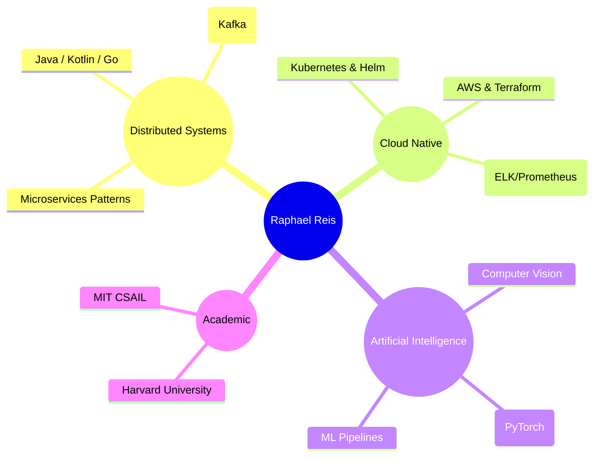

  

 

### 👨🏻‍💻 Engineering Philosophy

My work focuses on the intersection of **High-Scale Distributed Systems** and **Applied Artificial Intelligence**. I design architectures that are resilient, scalable, and data-driven.

---

### 🔬 Featured Case Study: TrendLab

> **Objective:** *Architect a production-grade ML pipeline for crypto market intelligence, strictly enforcing time-series validation rigor.*

I developed **[TrendLab](https://github.com/raphaelrreis/trendlab)** to demonstrate modern software engineering practices applied to quantitative finance.

| Architectural Domain | Implementation Details |
| :--- | :--- |
| **Pattern** | **Hexagonal Architecture (Ports & Adapters)** to decouple domain logic from infrastructure. |
| **Core Stack** | Python 3.9+, Pandas (Vectorized ops), Scikit-Learn (Logistic Regression). |
| **Infrastructure** | Docker, **Kubernetes (Helm)** for orchestration, **Terraform** for IaC (AWS/Azure). |
| **Engineering Rigor** | `Ruff` (Linting), `Mypy` (Static Typing), `Pytest` (Coverage), **GitHub Actions** (CI/CD). |

[**View Project Architecture »**](https://github.com/raphaelrreis/trendlab)

---

### 🛠 Technology Stack

  <table>
    <tr>
      <td align="center" width="90">
         Java
      </td>
      <td align="center" width="90">
         Kotlin
      </td>
      <td align="center" width="90">
         Go
      </td>
      <td align="center" width="90">
         Python
      </td>
      <td align="center" width="90">
         Kafka
      </td>
      <td align="center" width="90">
         Kubernetes
      </td>
      <td align="center" width="90">
         AWS
      </td>
      <td align="center" width="90">
         Terraform
      </td>
    </tr>
  </table>

---

### 📊 GitHub Analytics

  
  

 

  

    <em>"Architecture is about making the important things plain."</em>
  

