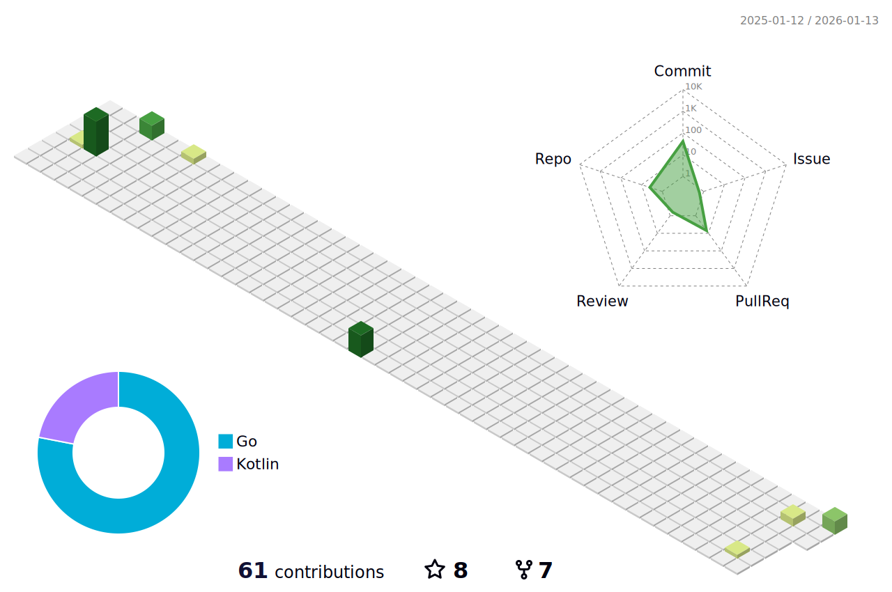

### Hi there, I'm Raphael Reis 👋

- 👨‍💻 **Senior Software Engineer** focused on High-Scale Distributed Systems.
- 🎓 **Lifelong Learner** with executive education from **Harvard** and **MIT CSAIL**.
- 🌱 Currently deep-diving into **Artificial Intelligence**, **Deep Learning**, and **Computer Vision**.
- 🔭 Working on building resilient, cloud-native architectures using **Java, Kotlin, Go**, and **Python**.

 

### 🛠 Technologies

  
  
  
  
  
  
  
  
  
  

 

### 🔬 Featured Engineering Projects

I build systems that solve complex distributed problems. Here are two distinct architectural implementations:

#### 1. TrendLab: ML & Data Engineering
> **Domain:** *Quantitative Finance & Time-Series Analysis*

A production-grade pipeline handling the complete lifecycle of financial data processing, strictly enforcing time-series validation rigor.

| Architecture | Tech Stack |
| :--- | :--- |
| **Hexagonal (Ports & Adapters)** | **Python**, Pandas, Scikit-Learn (Logistic Regression) |
| **Cloud Native** | Docker, **Kubernetes (Helm)**, **Terraform** (AWS/Azure) |
| **Engineering Rigor** | Ruff (Lint), Mypy (Types), Pytest (Coverage), CI/CD |

[**View TrendLab Architecture »**](https://github.com/raphaelrreis/trendlab)

 

#### 2. Saga Event Sourcing: Distributed Systems
> **Domain:** *Microservices Consistency & High-Throughput Transactional Systems*

A robust implementation of distributed transaction patterns to ensure eventual consistency across multiple services.

| Architecture | Tech Stack |
| :--- | :--- |
| **Distributed Patterns** | **Saga (Orchestration)**, **Event Sourcing**, **Circuit Breaker**, Transactional Outbox |
| **Core Stack** | **Java**, **Spring Boot**, **Apache Kafka**, Spring Cloud Sleuth (Tracing) |
| **Data Persistence** | **MongoDB** (Read/Write Models), Zipkin (Observability) |

[**View Saga Implementation »**](https://github.com/raphaelrreis/poc-saga-event-sourcing)

 

### 📊 GitHub Analytics

  

  
  

 
 

