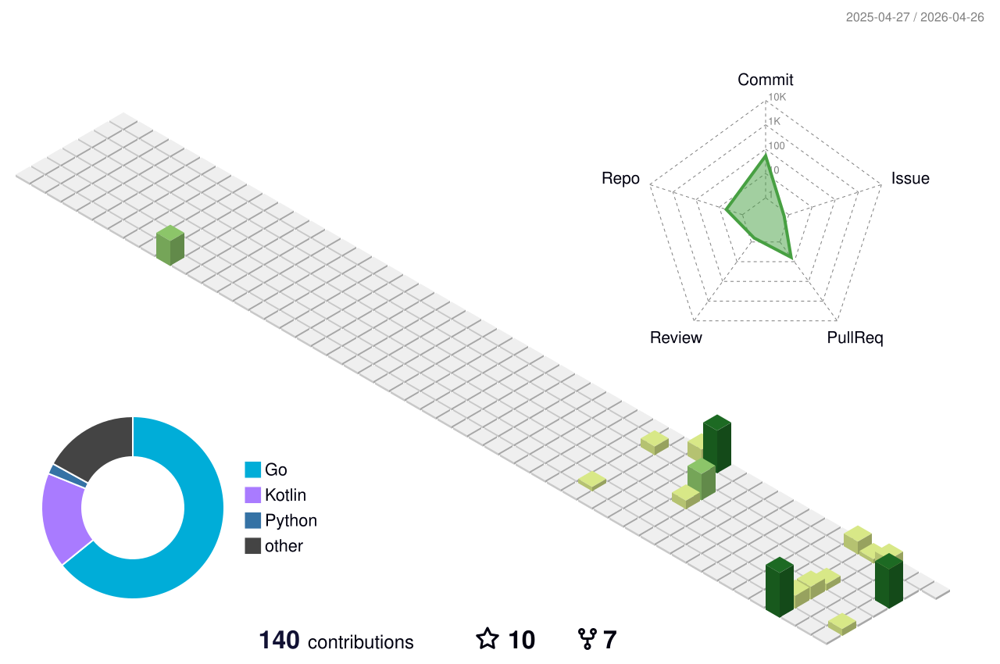

<div align="center">
  
</div>

```hcl
profile = {
  name       = "Raphael Reis"
  role       = "Senior Software Engineer"
  focus      = ["Distributed Systems", "Cloud-Native Architecture", "AI/LLM Engineering"]
  stack      = ["Java", "Kotlin", "Go", "Python", "Kafka", "Kubernetes", "Terraform"]
  principles = ["Engineering Rigor", "Type Safety", "Reliability", "Observability"]
}
```

<p align="center">
  Senior Software Engineer focused on high-scale distributed systems, cloud-native platforms, and AI/LLM exploration. I build resilient backend architectures, event-driven workflows, and production-grade data/ML systems with a strong bias for type safety, observability, and operational clarity.
</p>

<div align="center">
  <a href="https://www.linkedin.com/in/raphareis/"></a>
  <a href="mailto:rapphha@gmail.com"></a>
  <a href="https://www.harvard.edu/"></a>
  <a href="https://www.csail.mit.edu/"></a>
</div>

---

### Terminal: /whoami

<p align="left">
  
</p>

---

### Core Tech Stack

| Languages & Systems | Cloud & Infrastructure | AI & Data |
| :--- | :--- | :--- |
|  |  |  |
|  |  |  |
|  |  |  |
|  |  |  |
|  |  |  |
|  |  |  |

---

### Featured Architectural Work

<details open>
<summary><b>ApexStream | High-Performance Telemetry</b></summary>
<br>
Distributed system for real-time telemetry processing, built around low-latency ingestion, concurrency, worker pools, and cloud-native deployment.

- **Focus:** low latency, concurrent processing, event streaming.
- **Stack:** Go, NATS, gRPC, Protobuf, Kubernetes, Terraform.

[**View Repository ->**](https://github.com/raphaelrreis/apexstream)
</details>

<details>
<summary><b>TrendLab | ML & Data Engineering</b></summary>
<br>
Production-grade pipeline for quantitative finance and time-series analysis, with validation discipline around temporal data.

- **Architecture:** Hexagonal Architecture / Ports and Adapters.
- **Stack:** Python, Pandas, Scikit-Learn, Kubernetes, Terraform.

[**View Repository ->**](https://github.com/raphaelrreis/trendlab)
</details>

<details>
<summary><b>Saga Event Sourcing | Distributed Systems</b></summary>
<br>
Microservices consistency implementation using Saga orchestration, event sourcing, and resilient integration patterns.

- **Patterns:** Saga, Event Sourcing, Circuit Breaker, Transactional Outbox.
- **Stack:** Java, Spring Boot, Apache Kafka, MongoDB, Zipkin.

[**View Repository ->**](https://github.com/raphaelrreis/poc-saga-event-sourcing)
</details>

---

### Git Insights

<div align="center">
  
  
</div>

<div align="center">
  
</div>
